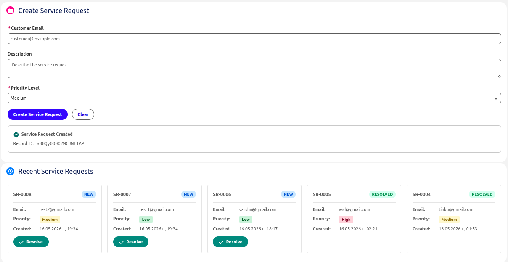

# Acme Services — Salesforce Take-Home

A small Salesforce DX project that lets agents create and resolve Service Requests. Built to show clean architecture, bulk-safe Apex, and a working LWC.

## Screenshot



## What's in the box

- `Service_Request__c` custom object + fields (metadata)
- `ServiceRequestService` — bulk-safe service class (create, resolve, query)
- `ServiceRequestController` — thin Apex controller for the LWC
- `serviceRequestForm` — LWC with form, recent requests grid, and resolve modal
- `ServiceRequestServiceTest` — test class covering positive, negative, and bulk cases
- `@InvocableMethod` for Agentforce / Flow integration
- Permission set for non-admin access

## Architecture

Kept it simple on purpose, no unnecessary abstraction layers:

- **Service class** owns all validation and DML. Everything goes through here.
- **Controller** is a thin wrapper that catches exceptions and re-throws as `AuraHandledException`.
- **LWC** handles UX (loading spinner, toasts, inline errors, resolve modal).
- All service methods accept lists, so they're bulk-safe out of the box.

## Data Model

**Object:** `Service_Request__c` (Auto Number: `SR-{0000}`)

| Field | Type | Notes |
|-------|------|-------|
| `Customer_Email__c` | Email | Required |
| `Status__c` | Picklist | New, In Progress, Resolved |
| `Description__c` | Long Text | — |
| `Resolution_Notes__c` | Long Text | Captured on resolve |
| `Priority__c` | Picklist | Low, Medium, High |

## Apex Methods

**ServiceRequestService**
- `createRequests(List<CreateRequestInput>)` — validates and inserts
- `resolveRequests(List<ResolveRequestInput>)` — flips status, saves notes
- `getRecentRequests(Integer)` — latest N records
- `resolveRequestsInvocable(...)` — `@InvocableMethod` for Flow/Agentforce

**ServiceRequestController**
- `createServiceRequest(email, description, priority)`
- `getRecentServiceRequests()` — cacheable, returns 5 latest
- `resolveServiceRequest(serviceRequestId, resolutionNotes)`

## LWC — `serviceRequestForm`

- Form: email, description, priority → creates a record
- Shows record ID on success
- Loading spinner + error handling
- Recent Requests: 5 cards in a row with status/priority badges
- Resolve button on non-resolved cards → opens modal for resolution notes

## Agentforce Bonus

Added an `@InvocableMethod` (`Resolve Service Request`) so it can plug directly into Agentforce as an AI Action or be called from any Flow.

The invocable just delegates to `ServiceRequestService.resolveRequests(...)`, so all the same validation (required notes, status guard, CRUD checks) applies regardless of whether a human or AI triggers it.

## Setup

### Prerequisites

- Salesforce CLI (`sf`)
- An authenticated org or scratch org
- Node.js + npm (for LWC tests)

### Deploy

```bash
sf org login web --alias acme-dev --instance-url https://login.salesforce.com --set-default
sf project deploy start -d force-app
sf org assign permset --name Service_Request_Access
```

For sandbox, use `https://test.salesforce.com` instead.

### Run Tests

```bash
# Apex
sf apex run test --tests ServiceRequestServiceTest --code-coverage --result-format human

# LWC (Jest)
npm install
npm test -- --runInBand
```

### Use the Component

1. Open Lightning App Builder
2. Drop `Service Request Form` onto a Home or App page
3. Save and activate

## Assumptions

- Deploying user has access to create custom objects and run Apex
- `Status__c` defaults to `New` on creation
- Resolution works from both the LWC (Resolve button) and programmatically (`@InvocableMethod`)
- `Priority__c` is validated in both the LWC and Apex
